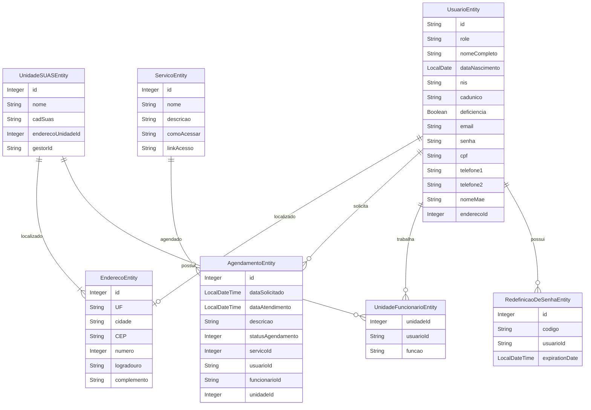

# *ASIS – Sistema Unificado de Assistência Social*  

## 📖 Sobre o Projeto  

O *ASIS* tem como objetivo desenvolver uma solução para o *Sistema Único de Assistência Social (SUAS), focada na digitalização e padronização do armazenamento de prontuários dos cidadãos atendidos pelos **Centros de Referência de Assistência Social (CRAS)*.  

Atualmente, as unidades do CRAS operam de forma isolada, sem integração de dados, o que dificulta o acesso e a atualização das informações. O *ASIS* propõe a unificação desses dados e centraliza o agendamento de serviços, permitindo uma comunicação eficiente entre as unidades, eliminando registros descentralizados e processos burocráticos, trazendo mais eficiência e organização para o atendimento às famílias.
  

Além disso, será desenvolvida uma *plataforma web* para gerenciar essas informações, possibilitando:  

- ✅ *Cadastro de cidadãos*  
- ✅ *Agendamento de atendimentos e serviços*  

Este repositório contém o código do *back-end* da aplicação, desenvolvido com foco em:  

- *🔄 Escalabilidade* – Suporte a um grande número de usuários, garantindo alto desempenho.  
- *🔗 Integração* – API otimizada para comunicação eficiente com o front-end.  
- *🎯 Usabilidade* – Interface intuitiva e eficiente para os usuários finais.  
- *🛠️ Manutenibilidade* – Código modular e bem estruturado para facilitar ajustes e melhorias.  

## 📌 Modelo de Dados


---
### **Explicações sobre as relações**
✔ **UsuarioEntity → EnderecoEntity**: Um usuário possui um endereço.

✔ **UsuarioEntity → AgendamentoEntity**: Um usuário pode solicitar vários agendamentos.

✔ **ServicoEntity → AgendamentoEntity**: Um agendamento está associado a um serviço.

✔ **UnidadeSUASEntity → EnderecoEntity**: Cada unidade do SUAS tem um endereço.

✔ **UnidadeSUASEntity → UnidadeFuncionarioEntity**: Uma unidade pode ter vários funcionários.

✔ **UsuarioEntity → UnidadeFuncionarioEntity**: Um usuário pode trabalhar em uma unidade SUAS.

✔ **UsuarioEntity → RedefinicaoDeSenhaEntity**: Um usuário pode ter um código de redefinição de senha.


## Como Utilizar

1. **Clone o Repositório**:
   ```bash
   git clone https://github.com/Projeto-ASIS/ASIS-API.git
   ```
2. **Acesse o diretório do projeto**:
   ```bash
   cd ASIS-API
   ```
3. **Execute o projeto**:
   - Usando Maven:
     ```bash
     mvn spring-boot:run
     ```
   - Usando Docker:
     ```bash
     docker-compose up --build
     ```

4. **Acesse a API**:
   - A documentação da API estará disponível em `http://localhost:8080/swagger-ui/index.html`.

## Dúvidas ou Suporte

Se você tiver qualquer dúvida relacionada ao projeto ou sobre como contribuir, sinta-se à vontade para entrar em contato pelo email: equipeasis@gmail.com.

Obrigado por ajudar a tornar este projeto melhor!
