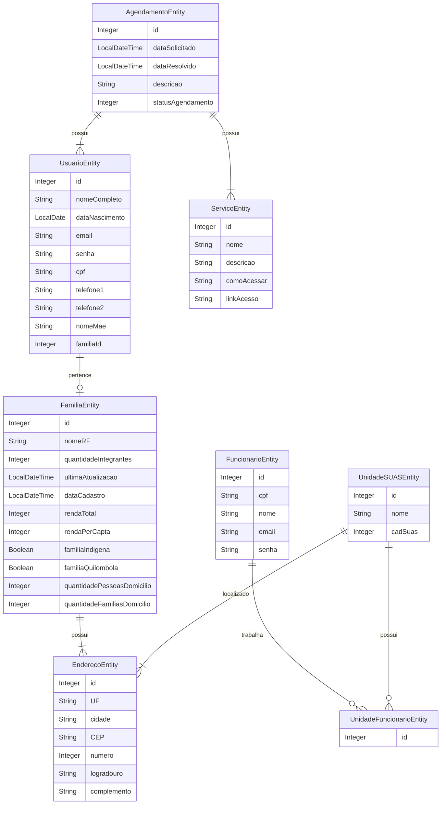

# *ASIS – Sistema Unificado de Assistência Social*  

## 📖 Sobre o Projeto  

O *ASIS* tem como objetivo desenvolver uma solução para o *Sistema Único de Assistência Social (SUAS), focada na digitalização e padronização do armazenamento de prontuários dos cidadãos atendidos pelos **Centros de Referência de Assistência Social (CRAS)*.  

Atualmente, as unidades do CRAS operam de forma isolada, sem integração de dados, o que dificulta o acesso e a atualização das informações. O *ASIS* propõe a unificação desses dados e centraliza o agendamento de serviços, permitindo uma comunicação eficiente entre as unidades, eliminando registros descentralizados e processos burocráticos, trazendo mais eficiência e organização para o atendimento às famílias.
  

Além disso, será desenvolvida uma *plataforma web* para gerenciar essas informações, possibilitando:  

- ✅ *Cadastro de cidadãos*  
- ✅ *Consulta e atualização de dados*  
- ✅ *Agendamento de atendimentos e serviços*  

Este repositório contém o código do *back-end* da aplicação, desenvolvido com foco em:  

- *🔄 Escalabilidade* – Suporte a um grande número de usuários, garantindo alto desempenho.  
- *🔗 Integração* – API otimizada para comunicação eficiente com o front-end.  
- *🎯 Usabilidade* – Interface intuitiva e eficiente para os usuários finais.  
- *🛠️ Manutenibilidade* – Código modular e bem estruturado para facilitar ajustes e melhorias.  

## 📌 Modelo de Dados


---
### **Explicações sobre as relações**
✔ **UsuarioEntity → FamiliaEntity**: Um usuário pertence a uma família.  
✔ **FamiliaEntity → EnderecoEntity**: Uma família tem um endereço.  
✔ **FuncionarioEntity → UnidadeFuncionarioEntity**: Funcionários são vinculados a unidades através dessa entidade intermediária.  
✔ **UnidadeSUASEntity → UnidadeFuncionarioEntity**: Uma unidade pode ter vários funcionários.  
✔ **AgendamentoEntity → UsuarioEntity e ServicoEntity**: Um agendamento é feito por um usuário e está ligado a um serviço.  
✔ **UnidadeSUASEntity → EnderecoEntity**: Cada unidade do SUAS tem um endereço.


## 🌟 Diferenciais do Projeto  

### 🚀 **Agendamento Unificado de Serviços**
Atualmente, os **CRAS** enfrentam desafios no compartilhamento de dados, o que dificulta o **acompanhamento contínuo das famílias atendidas**. Com o **ASIS**, todas as unidades terão acesso a um **banco de dados unificado**, possibilitando um atendimento **mais ágil, eficaz e integrado**.

O **ASIS** centraliza o agendamento de diversos serviços da assistência social, **eliminando processos burocráticos** e descentralizados, trazendo mais **eficiência** e **organização** para o atendimento às famílias.

### 🛡️ **Combate à Violência de Direitos**  
O **ASIS** não só visa melhorar a eficiência dos serviços prestados pelos **CRAS**, mas também desempenha um papel fundamental no **combate à violência de direitos**. A plataforma auxiliará na **identificação precoce de situações de risco** e na **implementação de medidas protetivas**, garantindo que os cidadãos atendidos sejam **monitorados e protegidos** de possíveis abusos, fortalecendo a **rede de proteção social**.


### 📑 *Digitalização dos Processos*  
Hoje, o agendamento e a entrevista para o *Cadastro Único (CadÚnico)* exigem a presença física do usuário e diversos documentos. Com a nova plataforma, será possível realizar *agendamentos online*, reduzindo burocracias e otimizando o fluxo de atendimento.  

### 📂 *Prontuário Digitalizado*  
Os prontuários físicos das famílias atendidas serão convertidos para um formato *digital, garantindo **acessibilidade* e *segurança* das informações.  

### 🏠 *Agendamento de Visitas Domiciliares*  
Atualmente realizadas de forma manual, as visitas domiciliares serão agendadas diretamente na plataforma, com *notificações automáticas* enviadas aos assistentes sociais. Além disso, o usuário será notificado assim que uma visita for agendada para sua residência, garantindo que ele esteja ciente e preparado para o atendimento.
to e preparação para o atendimento.


### 🔄 *Atualização Cadastral Simplificada*  
Diferente da plataforma *Conecta Recife, que não permite atualizações cadastrais de forma integrada, o **ASIS* possibilitará que os dados dos usuários sejam *mantidos sempre atualizados* dentro do sistema.

# Como Contribuir para o Repositório

Agradecemos seu interesse em contribuir para o nosso repositório! Seguir as etapas abaixo nos ajuda a manter um processo organizado e a melhorar continuamente nosso projeto.

## Como Começar

1. **Leia a Documentação**: Antes de começar, familiarize-se com os objetivos do projeto e leia os arquivos relevantes, como `README.md`, `CONTRIBUTING.md` (se existir), e a documentação do código.
2. **Verifique as Issues**: Consulte a lista de [Issues](./issues) abertas e veja se algo desperta seu interesse. Você também pode sugerir melhorias ou relatar problemas criando uma nova issue.
3. **Clone o Repositório**:
   ```bash
   git clone https://github.com/Projeto-ASIS/ASIS-API.git
   ```
4. **Configure o Ambiente**:
    - Siga as instruções no arquivo `README.md` para configurar e rodar o projeto localmente.

## Contribuição de Código

1. **Crie um Fork**: Faça um fork do repositório para o seu próprio espaço no GitHub.
2. **Crie um Branch**: Use um branch específico para sua contribuição.
   ```bash
   git checkout -b minha-nova-feature
   ```
3. **Implemente as Mudanças**: Escreva código limpo e inclua testes, se aplicável.
4. **Atualize a Documentação**: Certifique-se de atualizar os arquivos de documentação relevantes, caso sua contribuição exija alterações.
5. **Faça Commit das Mudanças**: Certifique-se de escrever mensagens de commit claras e informativas.
   ```bash
   git commit -m "Adiciona nova funcionalidade X"
   ```
6. **Sincronize o Repositório**: Garanta que seu branch esteja atualizado com o branch principal do repositório original.
   ```bash
   git pull origin main
   ```
7. **Envie o Branch para o seu Fork**:
   ```bash
   git push origin minha-nova-feature
   ```
8. **Abra um Pull Request**: Acesse o repositório original no GitHub e clique em "Compare & Pull Request".

## Boas Práticas

- **Siga o Estilo de Código**: Mantenha a consistência do estilo de código usado no projeto. Use ferramentas de lint se disponíveis.
- **Documentação e Comentários**: Explique seu código, especialmente partes complexas.
- **Testes**: Sempre que possível, inclua testes para validar suas alterações.
- **Revisões**: Esteja aberto a feedback durante o processo de revisão do pull request.

## Reportando Problemas

Se você encontrar um bug ou tiver sugestões de melhorias:

1. Verifique se o problema já foi relatado na página de [Issues](./issues).
2. Crie uma nova issue fornecendo informações detalhadas:
    - Descrição do problema ou sugestão.
    - Passos para reproduzir o problema (se aplicável).
    - Logs ou mensagens de erro (se existirem).

## Dúvidas ou Suporte

Se você tiver qualquer dúvida sobre como contribuir, sinta-se à vontade para entrar em contato abrindo uma issue ou utilizando outros meios de comunicação definidos no repositório.

Obrigado por ajudar a tornar este projeto melhor!
